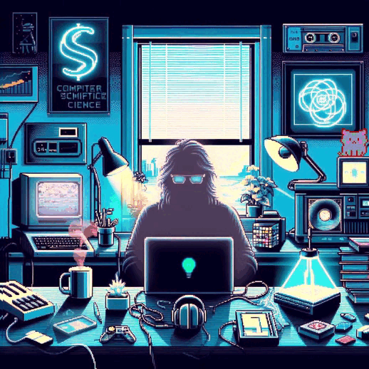

 

<h1 align="center">Hi 👋, I'm usri rshid</h1>
<h3 align="center">A zealous back-end developer and next software engineer from Morocco</h3>

  

  

  

- 🔭 I’m currently working on **reviews**

- 🌱 I’m currently learning **react,nodejs,django**

- 👯 I’m looking to collaborate on **e-commerce**

- 🤝 I’m looking for help with **shop website**

- 👨‍💻 All of my projects are available at [portfolio.com](portfolio.com)

- 📝 I regularly write articles on [blog.com](blog.com)

- 💬 Ask me about **python,c, javascript**

- 📫 How to reach me **usrirshid@gmail.com**

- 📄 Know about my experiences [portfolio-exp.com](portfolio-exp.com)

- ⚡ Fun fact **One of my hidden talents is inquis😎itive?**

### Blogs posts
<!-- BLOG-POST-LIST:START -->
<!-- BLOG-POST-LIST:END -->

<h3 align="left">Connect with me:</h3>

<h3 align="left">Languages and Tools:</h3>

                               

<h3 align="left">Support:</h3>

  

<h3 align="left">Stars</h3>

&nbsp;

<h3 align="center">Statistics</h3>

<a href="https://github.com/usri-rshid">

<h2 align="left">⚡Activity Graph:</h2>

